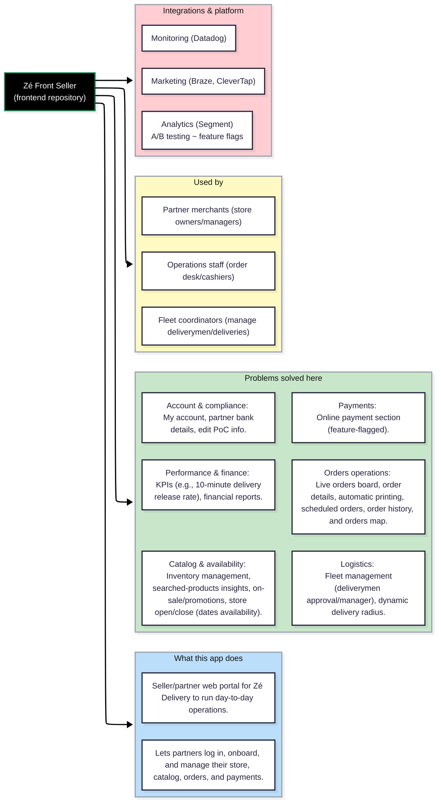

```mermaid
---
config:
  layout: elk
  look: neo
  theme: redux
  flowchart:
    nodeSpacing: 48
    rankSpacing: 64
    curve: basis
---
flowchart LR
subgraph What["What this app does"]
    direction TB
        Does1["Seller/partner web portal for Zé Delivery to run day-to-day operations."]
        Does2["Lets partners log in, onboard, and manage their store, catalog, orders, and payments."]
  end
subgraph Problems["Problems solved here"]
    direction TB
        ProbOrders["Orders operations: 
 Live orders board, order details, automatic printing, scheduled orders, order history, and orders map."]
        ProbCatalog["Catalog &amp; availability: 
 Inventory management, searched-products insights, on-sale/promotions, store open/close (dates availability)."]
        ProbLogistics["Logistics: 
 Fleet management (deliverymen approval/manager), dynamic delivery radius."]
        ProbAccount["Account &amp; compliance: 
 My account, partner bank details, edit PoC info."]
        ProbPayments["Payments: 
 Online payment section (feature-flagged)."]
        ProbPerf["Performance &amp; finance: 
 KPIs (e.g., 10-minute delivery release rate), financial reports."]
  end
subgraph UsedBy["Used by"]
    direction TB
        PartnerMerchants["Partner merchants (store owners/managers)"]
        OpsStaff["Operations staff (order desk/cashiers)"]
        FleetCoordinators["Fleet coordinators (manage deliverymen/deliveries)"]
  end
subgraph Integrations["Integrations & platform"]
    direction TB
        Analytics["Analytics (Segment) 
 A/B testing ~ feature flags"]
        Marketing["Marketing (Braze, CleverTap)"]
        Monitoring["Monitoring (Datadog)"]
  end
    App["Zé Front Seller 
 (frontend repository)"] --> UsedBy & What & Problems & Integrations

     App:::app
     UsedBy:::group
     What:::group
     Problems:::group
     Integrations:::group
    classDef app fill:#50C878,stroke:#2D8659,stroke-width:2px,color:#fff
    classDef group fill:#f3f4f6,stroke:#9ca3af,stroke-width:2px,color:#111
    style App fill:#000000
    style UsedBy fill:#FFF9C4
    style What fill:#BBDEFB
    style Problems fill:#C8E6C9
    style Integrations fill:#FFCDD2
```
